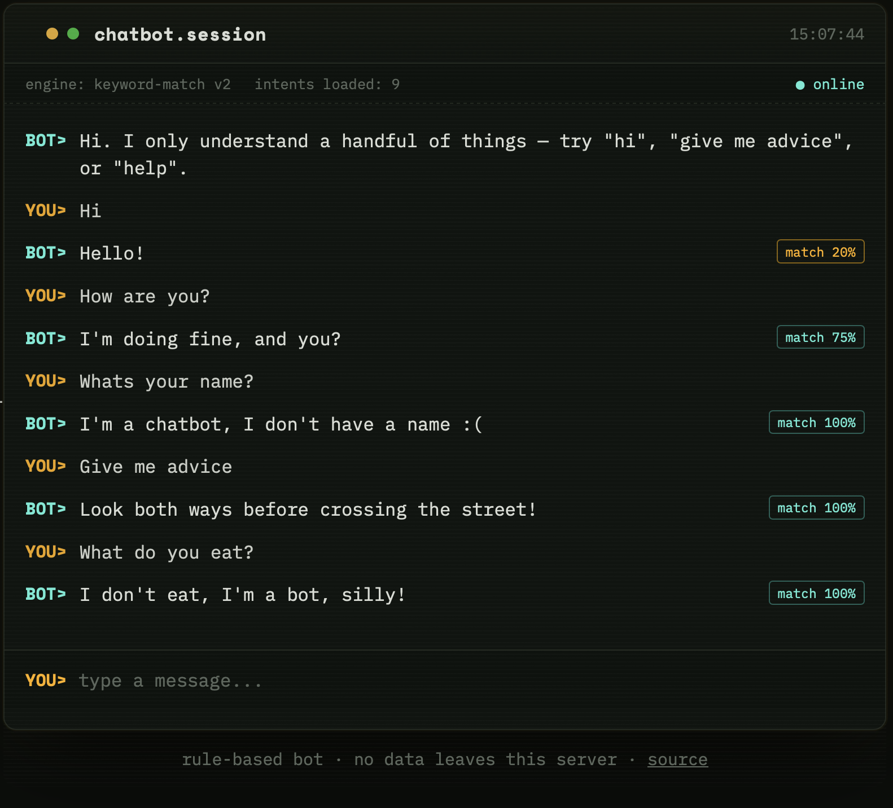

# chatbot

A simple rule-based chatbot, originally a terminal script and now with a web UI on top. No ML, no external API calls — just keyword matching, so it's a good reference for understanding how basic intent matching works before reaching for something heavier.



## How it works

The bot scores your message against a list of predefined intents based on word overlap, with typo tolerance via fuzzy matching (`difflib`). Whichever intent scores highest wins, as long as it clears a minimum confidence threshold — otherwise it falls back to a generic "I don't understand" response.

## Project structure

```
chatbot/
├── app.py               # Flask server (routes: / and /api/chat)
├── bot_engine.py         # Core matching logic — shared by app.py and mains.py
├── mains.py               # Terminal/CLI version of the bot
├── long_responses.py     # Canned longer replies + fallback responses
├── requirements.txt
├── templates/
│   └── index.html        # Chat UI page
└── static/
    ├── style.css          # Terminal-style visual design
    └── script.js          # Talks to /api/chat and renders the log
```

## Setup

```bash
python3 -m venv venv
source venv/bin/activate      # Windows: venv\Scripts\activate
python3 -m pip install -r requirements.txt
```

## Running it

**Web app:**
```bash
python3 app.py
```
Then open `http://127.0.0.1:5000` in your browser.

**Terminal version:**
```bash
python3 mains.py
```
Type `quit` or `exit` to leave.

## Try asking it

- `hi` / `hello`
- `how are you?`
- `what do you eat?`
- `give me advice`
- `what's your name?`
- `help`

It'll also tolerate small typos (e.g. `helo`, `advise`).

## Notes

- This runs Flask's development server — fine for local use, but not meant for production deployment as-is.
- The matching logic lives entirely in `bot_engine.py`, so it's easy to extend: add a new dict to the `INTENTS` list in that file with a `response`, `words`, and either `single_response` or `required_words`.
